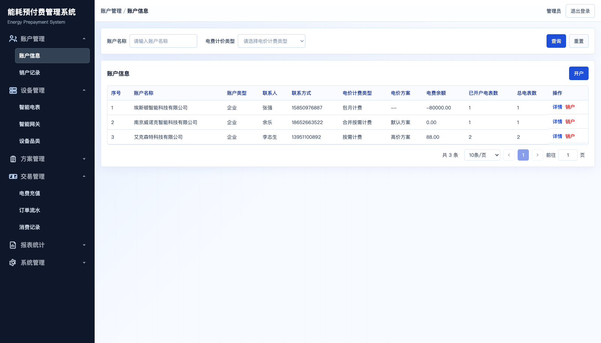
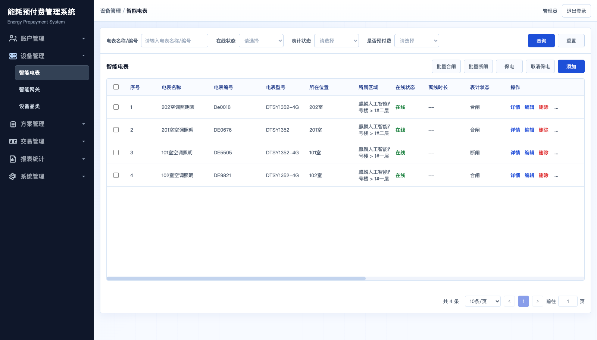
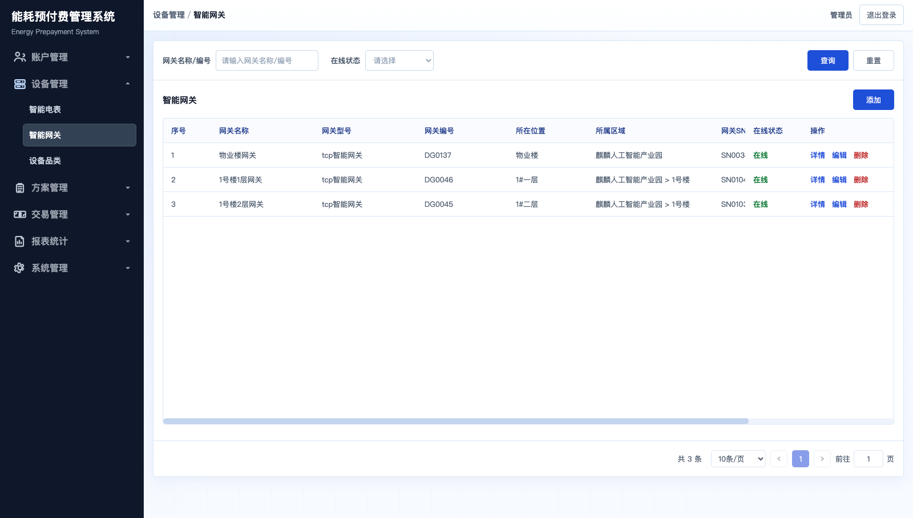
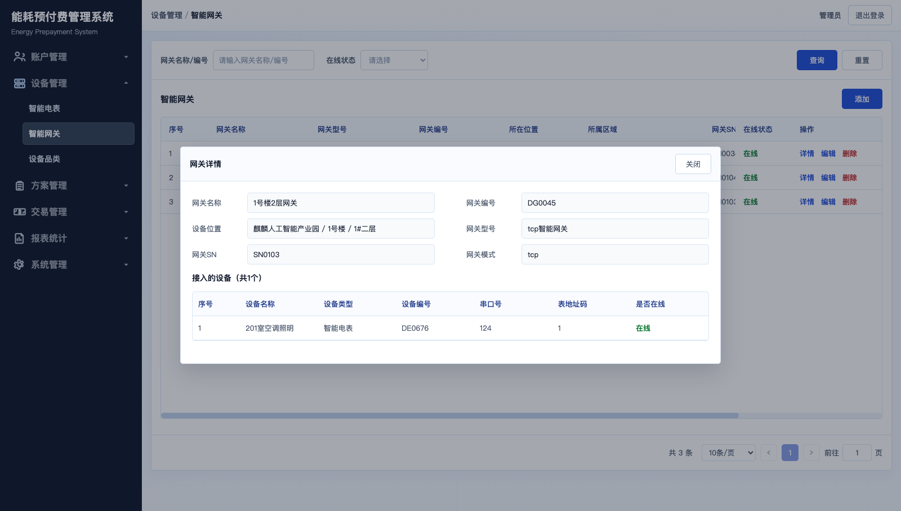
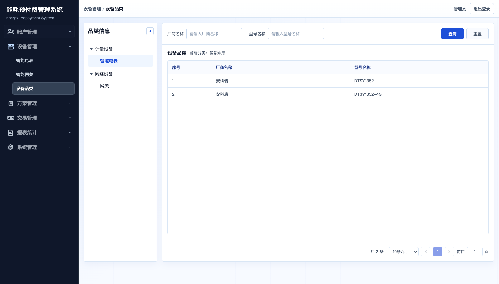
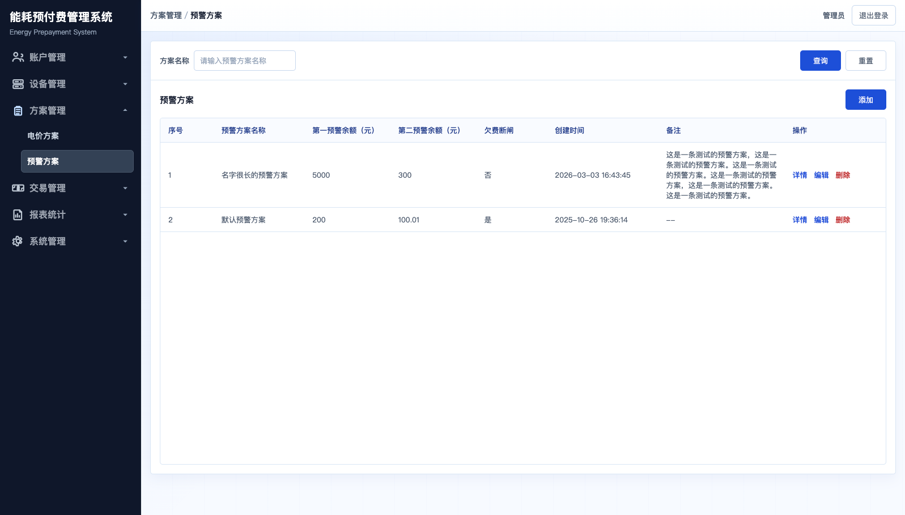
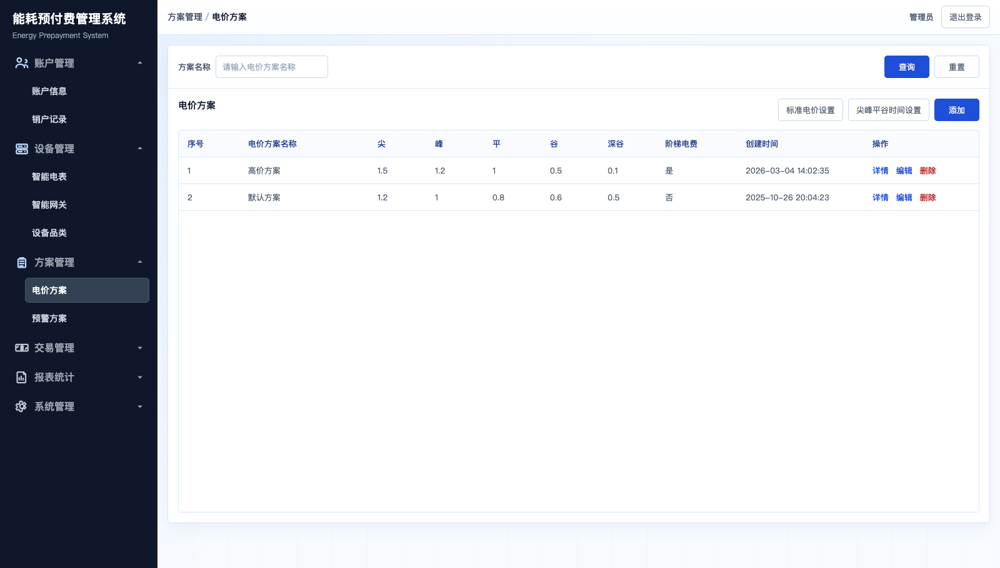
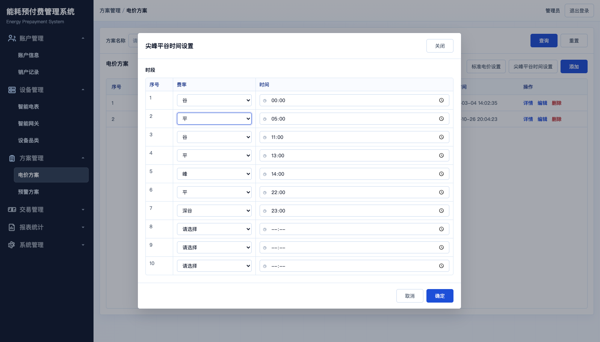

# EMS4J

[](https://openjdk.org/)
[](https://spring.io/projects/spring-boot)
[](LICENSE)

[English](README_EN.md)

EMS4J是一款基于Spring Boot多模块架构的能源管理系统，支持预付费和能耗分析两种模式。系统具有远程设备的控制能力，支持按需、合并、包月等多种计费方式。支持微信支付与线下支付。提供尖峰平谷计量、阶梯电价、账户管理与财务核算等完整功能，兼容多协议设备接入。代码结构清晰，易于二次开发与功能扩展。
## 动机
在AI能快速生成代码的今天，单纯“能运行”的代码正在贬值，而代码的品味与设计愈发珍贵。这种品味并非一蹴而就，它来自长期的架构锤炼与深刻的设计思考。

本项目正是这样一次实践：我对原有生产代码的架构进行了重构与精炼——通过清晰的层次划分和彻底的模块解耦，使核心逻辑更纯粹、更适应多变需求。

代码中融入了一些设计巧思，希望它能带来启发。正如“授人以鱼，不如授人以渔”，我更愿意分享的，是其中蕴含的设计思维与架构之道。

如果本项目对你有所帮助，欢迎点个 Star ⭐️ 作为支持，我将深感荣幸。

## 功能特性

- 多协议设备接入
- 计费模式（按需付费 / 合并付费 / 包月付费）
- 计量计费（尖峰平谷 / 阶梯电价）
- 账户管理（开户 / 销户 / 充值）
- 远程控制（合闸 / 分闸 / 复费率设置）
- 财务核算（账单 / 流水 / 对账）

## 系统截图

> 截图资源目录：`resource/images`

### 账户管理

| 页面 | 截图 |
|------|------|
| 账户列表 |  |
| 账户详情 |  |
| 销户结算 |  |

### 设备管理

| 页面   | 截图                                           |
|------|----------------------------------------------|
| 电表列表 |       |
| 电表详情 |  |
| 网关列表 |     |
| 网关详情 |   |
| 设备品类 |      |

### 告警与订单

| 页面 | 截图 |
|------|------|
| 预警方案列表 |  |
| 预警方案详情 |  |
| 订单列表 |  |
| 订单创建 |  |

### 计费配置

| 页面     | 截图                                             |
|--------|------------------------------------------------|
| 电价方案列表 |    |
| 电价方案详情 |  |
| 尖峰平谷时段 |           |

## 预付费模式说明

系统支持按需、合并与包月三种计费模式。其中按需与合并模式都是根据实际的使用对余额扣费。按需模式每个水电表独立核算。合并模式是把金额充值在一个水电表上，其他的表都用这个金额。包月按周期固定金额结算。

典型流程为开户后进行充值，扣费并持续更新余额，余额不足或触达预警阈值时可联动通知与远程断闸。全量销户时会进行清算并生成结算订单，产生退费或补缴。

## 环境要求

| 组件 | 版本 | 必需 |
|------|------|------|
| JDK | 17+ | 是 |
| Maven | 3.8+ | 是 |
| MySQL | 8.0+ | 是 |
| Redis | 6.0+ | 是 |
| RabbitMQ | 3.x | 否 |

## 快速开始

### 1) 克隆项目

### 2) 初始化数据库

```bash
mysql -u <user> -p <db> < sql/ems.sql
```

### 3) 修改配置

编辑 `ems-bootstrap/src/main/resources/application-dev.yml`：
- 数据库连接（`spring.datasource`）
- Redis 连接（`spring.data.redis`）
- RabbitMQ 连接（`spring.rabbitmq`，可选）

### 4) 构建并启动

```bash
mvn clean package -DskipTests
java -jar ems-bootstrap/target/ems-0.1.0.jar --spring.profiles.active=dev
```

### 5) 访问系统

- API 文档：http://localhost:8080/doc.html

## 构建与测试

```bash
# 全量构建（跳过测试）
mvn clean install -DskipTests

# 运行测试
mvn test

# 模块级构建/测试（示例）
mvn -pl ems-business/ems-business-device -am test
```

## 技术栈

| 类别 | 技术 |
|------|------|
| 语言/框架 | Java 17 / Spring Boot 3.5 |
| 持久层 | MyBatis-Plus / MySQL 8.0 |
| 缓存 | Redis / Redisson |
| 消息队列 | RabbitMQ（可选） |
| IoT 接入 | Netty |
| 认证 | Sa-Token + JWT |
| API 文档 | Knife4j / SpringDoc OpenAPI |

## 模块分层架构

```
+-------------------------------+          +-------------------------------+
|        ems-bootstrap          |          |           ems-iot             |
|       (Web Service Entry)     |          |      (IoT Service Standalone) |
+-------------------------------+          +-------------------------------+
               |                                          |
   +-----------+-----------+-----------+                  |
   |           |           |           |                  |
+--v-----+ +---v----+ +----v-------+   |                  |
| ems-web| | ems-mq | |ems-schedule|   |                  |
|(HTTP   | | (Msg)  | |  (Schedule)|   |                  |
| API)   | |        | |            |   |                  |
+--+-----+ +---+----+ +-----+------+   |                  |
   |           |            |          |                  |
   +-----------+------------+----------+------------------+
               |
+------------------------------------------------------------------+
|                        ems-business                               |
|    +------------+  +------------+  +------------+  +------------+ |
|    |   device   |  |  account   |  |  billing   |  |    order   | |
|    | (Device Mgmt)| | (Account   |  | (Balance & |  | (Trade &   | |
|    |            |  |  Mgmt)     |  |  Consume)  |  |  Payment)  | |
|    +------------+  +------------+  +------------+  +------------+ |
|    |    lease   |  |    plan    |  | aggregation|                 |
|    | (Owner &   |  | (Pricing   |  | (Cross-    |                 |
|    |  Space)    |  |  Plan)     |  | domain)    |                 |
|    +------------+  +------------+  +------------+                 |
+------------------------------------------------------------------+
               |
   +-----------+-----------+
   |                       |
+--v-------------------+  +v-----------------------+
|    ems-foundation    |  |    ems-components      |
| +------+ +---------+ |  | +----------+ +------+  |
| | user | |integrat.| |  | |datasource| | lock |  |
| +------+ +---------+ |  | +----------+ +------+  |
| +------+ +---------+ |  | +---------+ +-------+  |
| | space| | system  | |  | | context | | redis |  |
| +------+ +---------+ |  | +---------+ +-------+  |
| +------+ +---------+ |  +------------------------+
| | org  | | notifi. | |
| +------+ +---------+ |
+----------------------+
               |
       +-------v-------+
       |  ems-common   |
       | (Common Utils)|
       +---------------+
```

说明：
- ems-web 可直接依赖 ems-business 与 ems-foundation（用户/组织/空间/系统等基础域）。
- ems-web 仅依赖 service/dto，避免直接引用 repository/entity/mapper。
- ems-foundation 不反向依赖 ems-business/ems-web，保持基础域可复用。

## 数据流向

```
+----------+    命令下发    +----------+    协议转换    +----------+
|  ems-web |-------------->|  ems-iot |-------------->|   设备    |
+----------+               +----------+               +----------+
     ^                          |                          |
     |                          | 数据上报                  |
     |                          v                          |
     |                   +----------+                      |
     +-------------------|  业务层   |<---------------------+
        业务结果          +----------+
                              |
                              v
                        +----------+
                        |   MySQL  |
                        +----------+
```


## 模块说明

| 模块                            | 职责                                               |
|-------------------------------|--------------------------------------------------|
| `ems-bootstrap`               | 应用启动入口（Spring Boot）                              |
| `ems-web`                     | HTTP 接口层                                         |
| `ems-business-device`         | 电表、网关、设备档案管理                                     |
| `ems-business-account`        | 开户、销户、余额、充值                                      |
| `ems-business-billing`        | 余额、抄表消费、补正、账务流水                                 |
| `ems-business-order`          | 订单创建、支付回调、订单查询与完成处理                              |
| `ems-business-lease`          | 主体与空间租赁关系、租赁查询与退租校验                             |
| `ems-business-plan`           | 计费方案、费率、尖峰平谷时段                                   |
| `ems-business-aggregation`    | 跨域读聚合与应用层编排                                        |
| `ems-foundation-user`         | 用户认证、权限、角色                                       |
| `ems-foundation-organization` | 多租户、组织架构                                         |
| `ems-foundation-space`        | 空间/区域管理                                          |
| `ems-foundation-system`       | 系统配置                                             |
| `ems-foundation-integration`  | 第三方平台对接                                          |
| `ems-components-*`            | 通用组件（数据源/锁/上下文）                                  |
| `ems-mq-*`                    | 消息基础设施 API（ems-mq-api）与业务消息应用层实现（ems-mq-rabbitmq） |
| `ems-iot`                     | Netty 设备接入、协议解析                                  |
| `ems-schedule`                | 定时任务                                             |
| `frontend-web`  | 前端web页面 - Coming Soon                           |

说明：
- `ems-business-billing` 与 `ems-business-order` 由原 `finance` 领域拆分而来，分别承载账务与交易能力。
- `ems-business-lease` 独立承载主体与空间租赁关系，不再放在 `account` 中。
- ems-mq-api 提供消息契约与基础服务接口（基础设施层）。
- ems-mq-rabbitmq 属于业务消息应用层实现，承载业务消息监听与编排。

## 已支持设备

| 厂商 | 类型 |
|------|------|
| 安科瑞 (Acrel) | 电表 / 网关 |
| 斯菲尔 (Sfere) | 电表 |
| 仪歌 (Yige) | 电表 | 
| 燕赵 (Yke) | 电表 |

## IoT 平台对接

对接方式可分为两类：

1) **设备直连（自有平台）**
- 在 `ems-iot` 中实现协议接入、报文解析、命令翻译与事件发布。
- 推荐参考：
  - [协议接入指南](doc/modules/iot/protocol-integration-guide.md)
  - [Netty 多协议](doc/modules/iot/netty-multi-protocol.md)

2) **第三方 IoT 平台接入**
- 建议在 `ems-foundation/integration` 侧实现平台对接与数据同步，再与 `ems-iot`/业务域协同。
- 推荐参考：
  - [设备集成模块说明](doc/modules/foundation/ems-foundation-integration.md)

详细平台集成解决方案请参见：
- [IoT 平台集成解决方案](doc/iot-platform-integration-solutions.md)

## 开发文档

| 文档 | 说明 |
|------|------|
| [开发实践指南](doc/development-practices-guide.md) | 代码风格、命名约定及开发实践 |
| [业务模块文档](doc/modules/business/README.md) | 业务模块文档（设备、账户、财务、方案） |
| [基础模块文档](doc/modules/foundation/README.md) | 基础模块文档（用户、组织、空间、系统、集成） |
| [IoT 模块文档](doc/modules/iot/README.md) | IoT 模块文档，用于设备接入和协议集成 |
| [测试指南](doc/test-guidelines.md) | 单元测试和集成测试标准及最佳实践 |

## 许可证

本项目采用 MIT 许可证，详见 [LICENSE](LICENSE)。

## 联系方式

- 添加我的微信，请注名“ems4j”：
  
  
