# EMS4J: EMS Management System

[](https://openjdk.org/)
[](https://spring.io/projects/spring-boot)
[](LICENSE)

[中文文档](README.md)

EMS4J is an open-source EMS management system built on a Spring Boot multi-module architecture. It supports prepaid operations, energy-consumption analytics, IoT device access, remote device control, account management, and financial accounting. The system supports multiple billing models such as pay-as-you-go, consolidated billing, and monthly plans, and fits typical scenarios such as campus dormitories and industrial parks.
**It is also an open-source project for learning complex business modeling and Spring Boot multi-module architecture design.**

## Features

- Multi-protocol device access
- Billing models (pay-as-you-go / consolidated billing / monthly subscription)
- Metering and billing (peak/off-peak/valley / tiered rates)
- Account management (opening / closing / recharge)
- Daily report snapshots and electric bill reports (daily meter/account snapshots, list and detail queries)
- Remote control (switch on/off, multi-rate configuration)
- Financial accounting (bills, transactions, reconciliation)

## Typical Scenarios

- Dormitory EMS management systems
- Industrial park EMS management systems
- Prepaid energy management systems
- EMS systems with IoT-based remote meter control
- Java projects that need a reference for multi-module architecture and complex business modeling

## Quick Experience

### Live Demo

Frontend app: [http://119.45.165.253:30080](http://119.45.165.253:30080)

Demo credentials:
- Username: `admin`
- Password: `Abc123!@#`

### Run Locally

```bash
cp deploy/env.example .env
docker compose -f deploy/compose/docker-compose.full.yml up -d --build
```

Default access URLs:
- Frontend app: `http://127.0.0.1:4173`
- Backend API docs: `http://127.0.0.1:8080/doc.html`

Notes:
- `docker-compose.full.yml` starts frontend, backend, iot, iot-simulator, MySQL, Redis, and RabbitMQ together
- The first startup may take longer because images need to be built and dependencies initialized
- If you prefer running frontend and backend separately, see the `Development & Deployment` section below

## Development & Deployment

### Requirements

| Component | Version | Required |
|-----------|---------|----------|
| JDK | 17+     | Yes |
| Maven | 3.8+    | Yes |
| MySQL | 8.0+    | Yes |
| Redis | 6.0+    | Yes |
| RabbitMQ | 4.1+    | No |
| Node.js | 18.18+  | Required for frontend development/build |
| pnpm | 10.32+  | Required for frontend development/build |

Clone the repository first:

```bash
git clone <repository-url>
cd ems4j
```

### Option A: Docker local development mode

Backend middleware dependencies can be started with Docker Compose:

```bash
cp deploy/env.example .env
docker compose -f deploy/compose/docker-compose.infra.yml up -d
```

Then start backend and frontend separately:

```bash
# backend
mvn clean package -DskipTests
java -jar ems-bootstrap/target/ems-*.jar --spring.profiles.active=dev

# frontend
cd frontend-web
pnpm install
pnpm dev
```

### Option B: Full Docker startup

```bash
cp deploy/env.example .env
# full container mode uses: ems-bootstrap/src/main/resources/application-docker.yml
docker compose -f deploy/compose/docker-compose.full.yml up -d --build
```

Notes:
- `deploy/compose/docker-compose.infra.yml`: MySQL / Redis / RabbitMQ only
- `deploy/compose/docker-compose.full.yml`: backend / frontend / iot / iot-simulator / middleware
- RabbitMQ image already includes the `x-delayed-message` plugin
- `iot` uses the `docker,netty` profile by default and listens on `8880` and `19500`
- `iot-simulator` uses the `docker` profile by default and connects to `iot:19500`
- `iot-simulator` persists runtime state to `/app/.data/iot-simulator-state.json`
- If replay start and end times are not configured explicitly, `iot-simulator` replays data from the first day of the current month up to one second before now. If the state file already exists, replay resumes from the saved cursor instead of restarting from month start every time

### Option C: Helm / K3s deployment

The project already includes Helm charts for a single-node K3s setup. This is the recommended path when deploying `backend / frontend / iot / iot-simulator / mysql / redis / rabbitmq` together on Kubernetes.

Entry document:
- [deploy/helm/README.md](/Users/jerry/Workspace/github/ems4j/deploy/helm/README.md)

The current Helm layout includes:
- `ems-infra`: MySQL, Redis, RabbitMQ
- `ems-app`: Backend, Frontend, IOT, IOT Simulator

Recommended prerequisites:
- Harbor or another reachable image registry
- A K3s cluster with namespaces `ems-infra` and `ems-app`
- The image pull secret `harbor-pull-secret` in both namespaces

The Helm guide already includes:
- Image build and push commands
- Installation commands for `ems-infra` and `ems-app`
- Post-deployment verification commands
- Log inspection steps for `iot` and `iot-simulator`

### Option D: Manual environment setup

```bash
# import database
mysql -u <user> -p <db> < deploy/mysql/init/001-ems.sql
mysql -u <user> -p <db> < deploy/mysql/init/002-menu.sql
mysql -u <user> -p <db> < deploy/mysql/init/003-example.sql
mysql -u <user> -p <db> < deploy/mysql/init/101-iot.sql

# install RabbitMQ x-delayed-message plugin
# @see https://github.com/rabbitmq/rabbitmq-delayed-message-exchange
```

Edit `ems-bootstrap/src/main/resources/application-dev.yml`:
- Database connection (`spring.datasource`)
- Redis connection (`spring.data.redis`)
- RabbitMQ connection (`spring.rabbitmq`, optional)

Frontend proxy target defaults to `http://127.0.0.1:8080` and can be overridden:

```bash
cd frontend-web
VITE_PROXY_TARGET=http://127.0.0.1:18080 pnpm dev
```

Build and run:

```bash
mvn clean package -DskipTests
java -jar ems-bootstrap/target/ems-*.jar --spring.profiles.active=dev
```

## Build & Test

```bash
# Full build (skip tests)
mvn clean install -DskipTests

# Run tests
mvn test

# Module build/test (example)
mvn -pl ems-business/ems-business-device -am test

# Frontend
cd frontend-web
pnpm typecheck
pnpm test:unit
pnpm test:unit:coverage
pnpm test:e2e
```

## Tech Stack

| Category | Technology |
|----------|------------|
| Language/Framework | Java 17 / Spring Boot 3.5 |
| Persistence | MyBatis-Plus / MySQL 8.0 |
| Cache | Redis / Redisson |
| Message Queue | RabbitMQ (optional) |
| IoT Access | Netty |
| Auth | Sa-Token + JWT |
| API Doc | Knife4j / SpringDoc OpenAPI |

## Module Layered Architecture

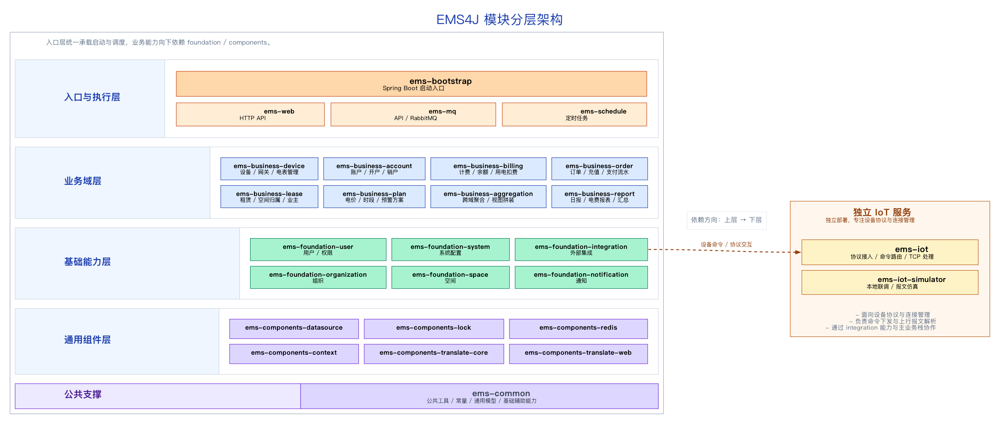

Notes:
- ems-web can depend on both ems-business and ems-foundation (user/org/space/system, etc.).
- ems-web should depend on service/dto only; avoid direct repository/entity/mapper access.
- ems-foundation should not depend on ems-business/ems-web to keep base domains reusable.

## Data Flow

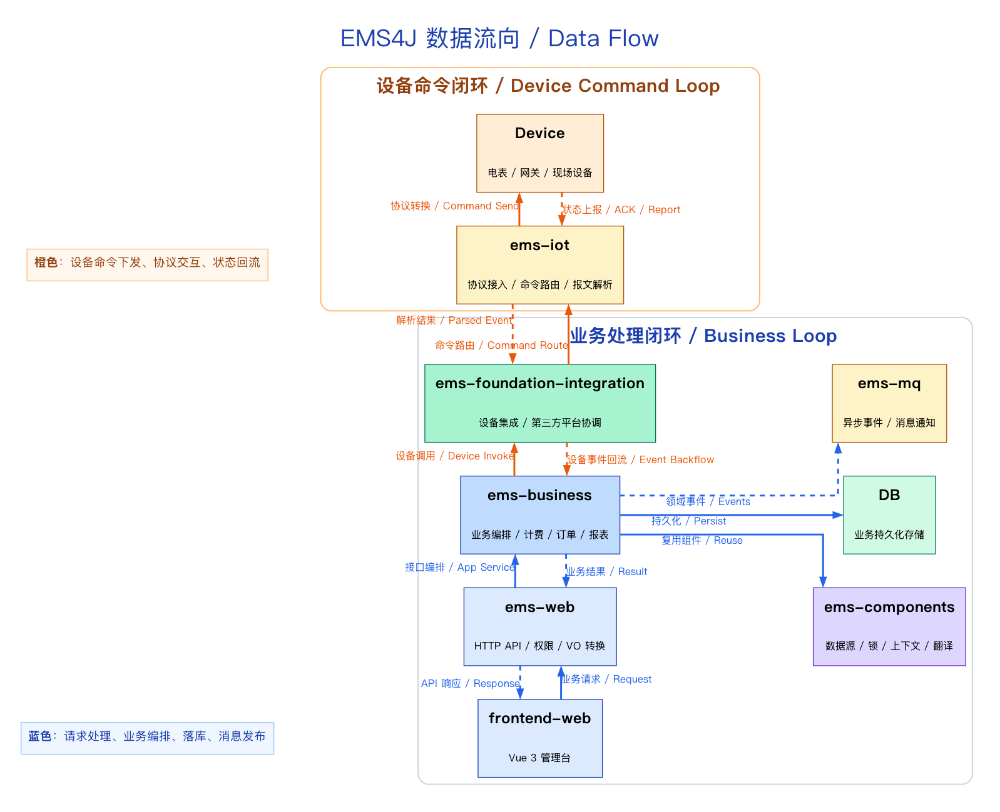

## Module Details

| Module | Responsibility |
|--------|----------------|
| `ems-bootstrap` | Application entry (Spring Boot) |
| `ems-web` | HTTP API layer |
| `ems-business-device` | Meter, gateway, device management |
| `ems-business-account` | Account opening, closing, balance and recharge |
| `ems-business-billing` | Balance, meter consumption, correction, billing flows |
| `ems-business-order` | Order creation, payment callback, order query and completion |
| `ems-business-lease` | Owner-space lease relation, lease query and unlease validation |
| `ems-business-plan` | Pricing plans, rates, time-of-use periods |
| `ems-business-aggregation` | Cross-domain read aggregation and application orchestration |
| `ems-foundation-user` | Authentication, permissions, roles |
| `ems-foundation-organization` | Multi-tenant, org structure |
| `ems-foundation-space` | Space/area management |
| `ems-foundation-system` | System configuration |
| `ems-foundation-integration` | Third-party platform integration |
| `ems-components-*` | Common components (datasource/lock/context) |
| `ems-mq-*` | Messaging infrastructure API (ems-mq-api) and business messaging app layer (ems-mq-rabbitmq) |
| `ems-iot` | Netty device access, protocol parsing |
| `ems-iot-simulator` | IoT device simulator, currently supporting Acrel 4G direct meter TCP access, historical replay, live reporting, and basic command responses |
| `ems-schedule` | Scheduled jobs |
| `frontend-web` | Vue 3 + TypeScript admin frontend with Vitest unit tests and Playwright smoke tests |
| `deploy`  | Deployment assets including Docker Compose files, Helm charts, Dockerfiles, init SQL, environment examples, and K3s deployment guidance |

Notes:
- ems-mq-api provides message contracts and base messaging services (infrastructure layer).
- ems-mq-rabbitmq is the business messaging app layer, hosting message listeners and orchestration.
- Frontend details are maintained in [`frontend-web/README.md`](frontend-web/README.md).

## Supported Devices

| Vendor | Type |
|--------|------|
| Acrel (安科瑞) | Meter / Gateway |
| Sfere (斯菲尔) | Meter |
| Yige (仪歌) | Meter |
| Yke (燕赵) | Meter |

## IoT Integration

There are two integration approaches:

1) **Direct device access (in-house platform)**
- Implement protocol access, parsing, command translation, and event publishing in `ems-iot`.
- References:
  - [Protocol Integration Guide](doc/modules/iot/protocol-integration-guide.md)
  - [Netty Multi-Protocol](doc/modules/iot/netty-multi-protocol.md)

2) **Third-party IoT platforms**
- Implement platform adapters under `ems-foundation/integration` and coordinate with `ems-iot` and business modules.
- Reference:
  - [Integration Module Overview](doc/modules/foundation/ems-foundation-integration.md)

For detailed platform integration solutions, see:
- [IoT Platform Integration Solutions](doc/iot-platform-integration-solutions.md)

## Documentation

| Document | Description |
|----------|-------------|
| [Development Practices Guide](doc/development-practices-guide.md) | Code style, naming conventions and development practices |
| [Business Module Documentation](doc/modules/business/README.md) | Business modules documentation (device, account, billing, order, lease, plan) |
| [Foundation Module Documentation](doc/modules/foundation/README.md) | Foundation modules documentation (user, organization, space, system, integration) |
| [IoT Module Documentation](doc/modules/iot/README.md) | IoT module documentation for device access and protocol integration |
| [Test Guidelines](doc/test-guidelines.md) | Unit and integration test standards and best practices |

## Key Screens

### Core Business Loop

| Page | Screenshot |
|------|------------|
| Account Detail | 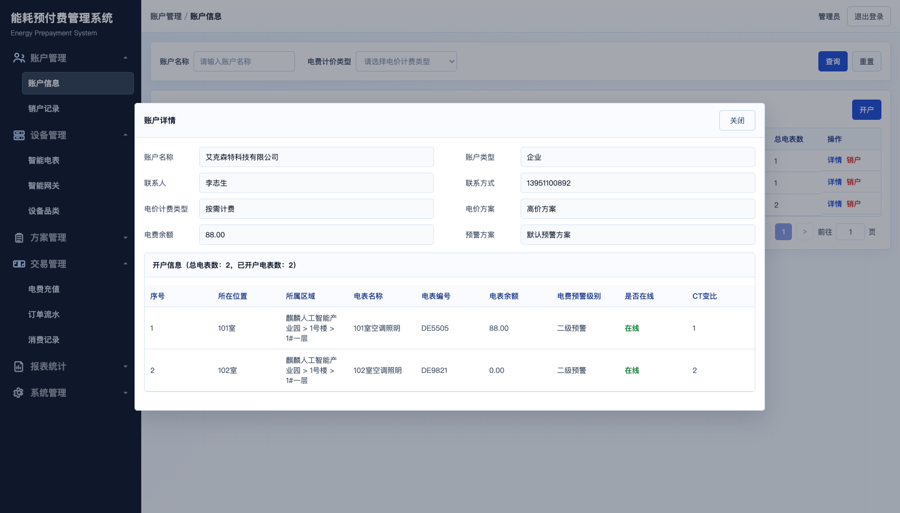 |
| Account Settlement | 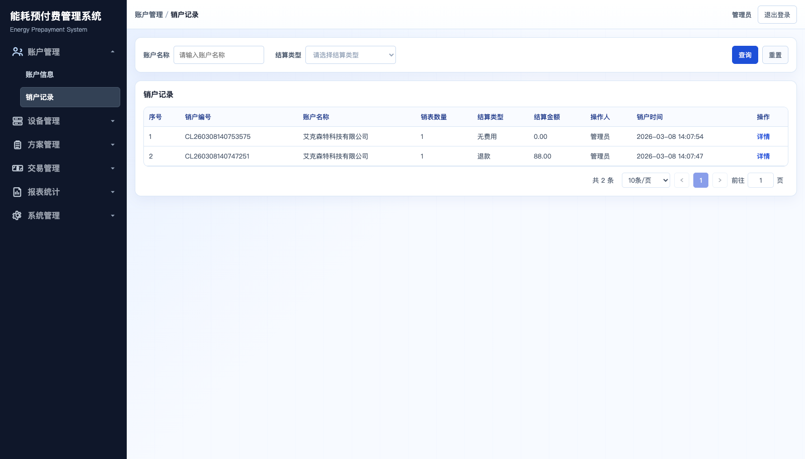 |
| Order List | 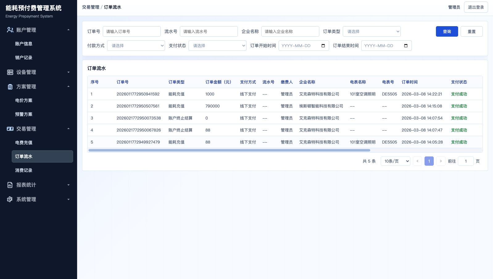 |
| Order Creation | 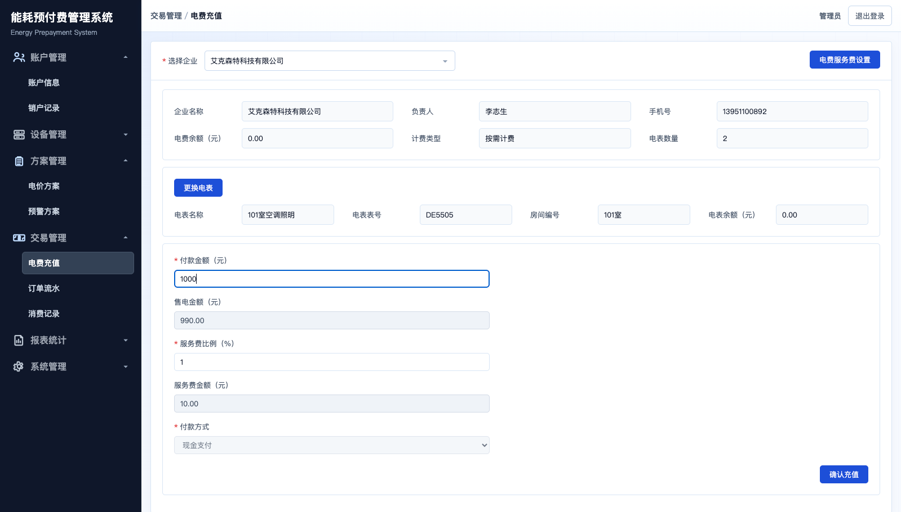 |

### Device and Billing Capabilities

| Page | Screenshot |
|------|------------|
| Meter Detail | 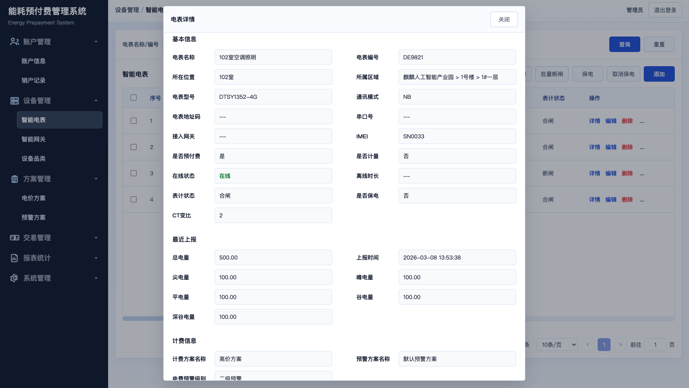 |
| Power Consumption Trend | 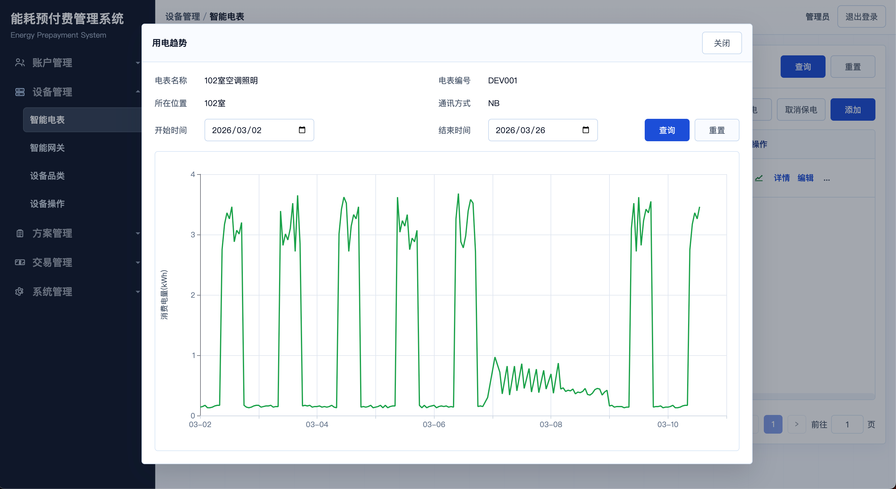 |
| Electric Bill Report | 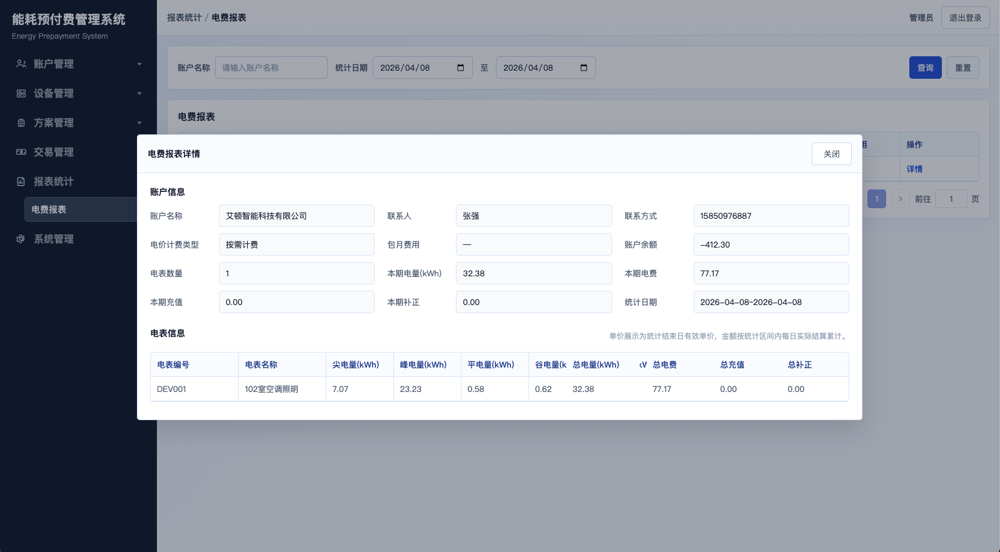 |
| Price Plan Detail | 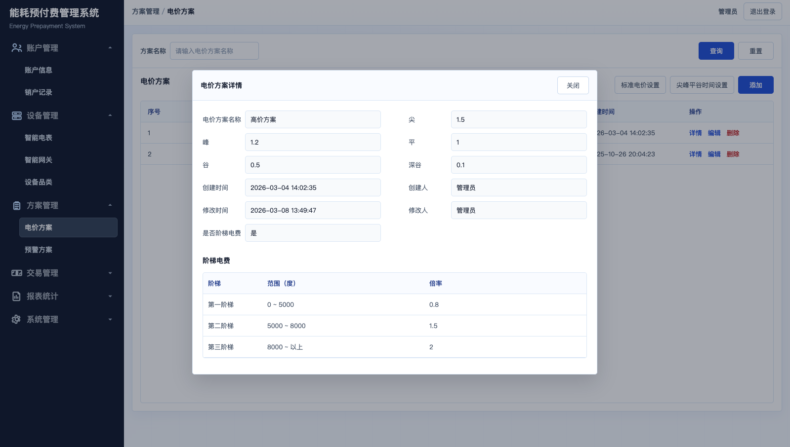 |
| Warning Plan Detail | 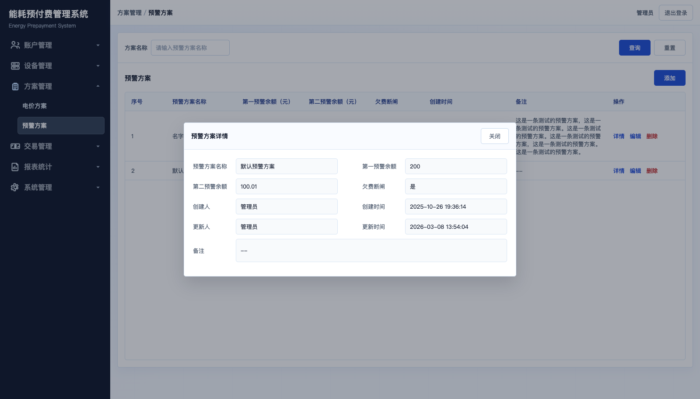 |

## Motivation

This project grew out of an ongoing effort to reorganize and refactor a real-world complex business system.

In a prepaid energy domain, devices, accounts, billing, orders, permissions, and remote control are tightly coupled. As the business evolves, unclear module boundaries quickly make the code harder to maintain and harder to extend.

EMS4J is not only about making the features work. It is about making those relationships explicit: what belongs to `device`, what belongs to `billing`, what should be split out of `account`, and what logic should remain in upper-layer orchestration.

That is why this repository is both a runnable prepaid energy system and a practical reference for complex domain modeling, module-boundary governance, and engineering maintainability.

If this project gives you useful ideas, consider giving it a ⭐️.

## License

This project is licensed under the MIT License. See [LICENSE](LICENSE).

## Contact

- Add me on WeChat and note `ems4j`:
  
  

- Zhihu Column: [能源管理系统实践](https://www.zhihu.com/column/c_2017220125376401881)
